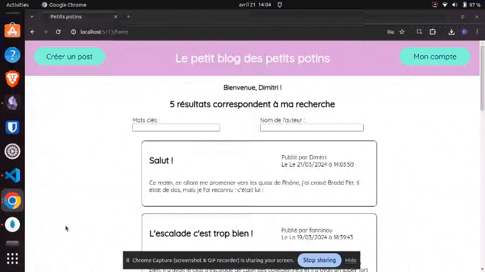

# Le petit blog des petits potins

## Quick demo :

### Rechercher par mots clés, login en tant qu'admin, supprimer un post en tant qu'admin :


### Logout, se connecter en tant qu'user avec une erreur de mot de passe, créer un post (avec le texte par défaut) :


### Register, et confirmer le compte :


### Mot de passe oublié, choisir un nouveau mot de passe :


## Sommaire : 
### I : Présentation des fonctionnalités

Le petit blog des petits potins est un blog très simple permettant à un utilisateur de poster des histoires. On peut y faire une recherche par mots clés, et par nom de l'auteur.
Un utilisateur peut avoir trois statuts : 
- pending : il n'est pas encore validé.
- user : utilisateur validé, il peut publier des posts.
- admin : il peut publier et supprimer des posts.

Depuis la page d'accueil, l'utilisateur peut créer un post, et se login ou accéder aux informations de son compte s'il est déjà connecté.

Si un utilisateur non connecté ou non validé essaie de créer un post, il sera renvoyé sur la page de login.

Sur la page de login, l'utilisateur a accès à une page de création de compte, ou à une page de mot de passe oublié.

Quand un utilisateur essaie de se login, s'il entre un nom d'utilisateur ou une adresse mail inexistants, il recevra un message d'erreur adapté. S'il entre un mauvais mot de passe, également. Si le login est réussi, il est redirigé à l'accueil et peut désormais publier.

Si un utilisateur veut se register, il devra entrer une adresse mail, un nom d'utilisateur, qui n'existent pas encore dans la DB. Ensuite, il devra entrer deux fois un mot de passe compris entre 7 et 14 caractères. S'il a réussi, un message lui indique qu'un mail lui a été envoyé et l'adresse mail en question est précisée. En cliquant sur ce lien, l'utilisateur active son compte et est logged in.

Si un utilisateur oublie son mot de passe, il suivra un processus similaire : il demandera un lien, qui le renverra vers une page où il devra entrer deux fois son nouveau mot de passe et pourra ensuite se login.

### II : Requis, commandes et architecture

#### Tech stack :
- MongoDB et mongoose
- Express
- Svelte et SvelteKit
- Node JS

#### Mettre en place le projet :
Dans le terminal :
- dossier Petits Potins :
	- `npm install concurrently` : concurrently permet de lancer le serveur de backend et de frontend simultanément
	- `cd src/lib/server` 
	- ` npm install mongoose morgan cors dotenv nodemailer express`
	- `cd ../../../`
	- `npm run dev` pour lancer les serveurs
- Un bug non encore résolu empêche parfois le bon routage des pages forgottenpassword. Ce bug soit enlève les styles, soit redirige vers la page de login. Si ce bug arrive, il faut renommer le dossier forgottenpassword dans src/routes, et le renommer à nouveau forgottenpassword, pendant que le serveur tourne.

Rediriger les requêtes envoyées à /api vers le serveur de backend :
```
export default defineConfig({
	plugins: [sveltekit()],
		server :{
			proxy : {
				'/api': {
					target:"http://localhost:3000"
			}
		}
	}
});
```

#### Requis
- Avoir une BDD sur MongoAtlas ou en local
- Avoir une adresse mail configurée pour accepter les envois de mails par une app : [tuto](https://medium.com/@y.mehnati_49486/how-to-send-an-email-from-your-gmail-account-with-nodemailer-837bf09a7628)
- Un fichier .env dans src/lib/server avec :
	- MONGO_URI : le lien de connexion à la BDD
	- MAILER_ADRESS : l'adresse mail qui va envoyer les mails
	- MAILER_PASSWORD : le mot de passe de l'adresse mail (pas celui pour se connecter classiquement au compte mais celui spécifiquement utilisé pour se connecter à une app externe)

#### Architecture 

- static : contient les fonts et les images ainsi que deux fichiers css : global et fonts, les styles globaux et les polices.
- src : contient tout le code écrit pour l'app.
	- lib : contient du code utilisé partout dans l'app, et le server
	
		config.js : définit des options comme la durée de vie des cookies, l'URL de l'API, la liste des cookies qui définit un user
		functions.js : contient quelques fonctions qui sont utilisées ailleurs dans le code
		
		- server : contient le code du server de backend
			- models : contient les modèles des données, User et Post ici
			- routes : contient routes.js, qui définit toutes les routes de l'API
			config.js : donne le numéro de PORT utilisé pour le backend, l'URI de la DB, l'EMAIL, l'URL du Website (qui n'est que rappelé ici, pas défini), TRANSPORTER qui définit l'outil de transport mail : il utilise .env
			.env : stocke de manière sécurisée le string de connexion à l'URI et les identifiants de connexion au transporter.
			server.js : le fichier qui lance le serveur backend
		- components
			Navbutton : le bouton de navigation, très utilisé
			TitrePage : présent sur presque chaque page, avec un contenu différent
	- routes
		La page d'erreur, de layout, et un redirect de '/' à '/home'
		- Tous les folders contenant les routes de l'app